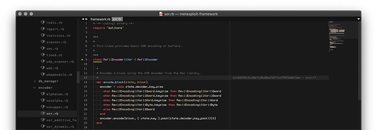

# Packed
    
  
<p align="center"></p>
  
<p align="center"><b>Ultra dark user interface for Sublime Text 3.**</b></p>
  
<p align="center"><a href="https://github.com/duraki/sublime-packed">[github]</a>, <a href="https://duraki.github.io/packed">[website]</a>, <a href="https://duraki.github.io/sublime-packed/screenshot/out/index.html">[screenshots]</a></p>
  
Fully featured Sublime Text 3 UI redesign. Custom theme & color scheme. In hackish, digital and sick form. Inspired by Vim, Emacs, [irssi](https://github.com/ronilaukkarinen/weed) and alike.
  
Parent hierarchy:  
  * **Icon set**: [FileIcons](https://github.com/braver/FileIcons) + custom icons
  * **Colorscheme**: [1337 Scheme](https://github.com/MarkMichos/1337-Scheme) + custom fixes
  * **Themes**:
    * [Spacefunk](https://github.com/Twiebie/ST-Spacefunk) => 
    * [Devastate](https://github.com/vlakarados/devastate) => 
    * [DevastateMini](https://github.com/shagabutdinov/sublime-devastate-mini) =>
    * **Package**: [Packed](https://github.com/duraki/sublime-packed) => (this package)
  
Icons distributed by [braver/FileIcons](https://github.com/braver/FileIcons). Theme DevastateMini 
distributed by [vlakarados/devastate](https://github.com/vlakarados/devastate).
  
To clone this repository:

```bash
$ git clone git@github.com:duraki/sublime-packed.git
```
  
## Introduction
  
Since switching to ST3, I've spent time searching for config that will support all my requirements. I found none. Therefore, I built this for myself and now share it openly, so others can enjoy it too.
  
| **Pros**                   | **Cons**                                    |
|:---------------------------|:--------------------------------------------|
| easy to use                | might get you addicted to ST3               |
| easy to extend             | your friends will think you are hacking NSA |
| looks slick out-of-the box | ???                                         |
| 30x productivity increase  | ???                                         |
  
**New features**:  
  * Unique, Vim-like user interface  
  * Max compact view, forced minimal dimensions on UI elements  
  * New color scheme, easy on your eyes  
  * Includes `*.sublime-settings` to provide custom mods  
  * Includes `tewi` (bitmap) font provided by @Confuseh (@see lucy/tewi-font#23)  
  * Includes *Extras* for featured/supported Packages (@see `/extras`)  
  * Richful syntax support for [Ruby](https://www.ruby-lang.org/) & [Crystal](http://crystal-lang.org/)  
  
Linux and OSX friendly! Tested under MacOS High Sierra, Sublime Text build 3176.
  
## Requirements
  
This interface is supported and developed on Sublime Text 3, I will not provide 
patches to older versions! 
  
* Sublime Text 3 (tested on build 3176) 
* Package Control for quick install (else, do manual installation)
* `Tewi` font installed (included ttf in `/ttf/tewi.ttf`)
  - **MacOS / OSX**: `cp ttf/tewi.ttf ~/Library/Fonts/`
  - **GNU / Linux**: `cp ttf/tewi.ttf ~/.fonts/ && fc-cache -f`
  
## Installation

### via Package Control

1. Make sure you already have [Package Control](https://packagecontrol.io/installation) installed.
2. Choose Install Package from the Command Palette (via `Tools > Coomand Palette` from the main menu).
3. Select **`Packed`** and press <kbd>Enter</kbd>.
4. Latest official release requests at [wband/package_control_channel](https://github.com/wbond/package_control_channel/pull/7521)
  
### or Manual Installation

1. Download or clone the desired **`sublime-packed`** repository.
2. Browse Packages from the Command Palette (via `Preferences > Browse packages` from the main menu).
3. Copy the **`sublime-packed`** file to `Packages/User/`.
  
### or Other way

The best way to use this theme professionally is to fork it, otherwise installing 
the package will not store permanent changes.
  
## Activation
  
To activate the UI, you need to configure and enable it through `User.Preferences` file.
  
Simply go to User Preferences (`"Preferences: Settings - User"` in command palette) and add:
  
    "color_scheme": "Packages/Packed/Packed.tmTheme",
    "theme": "Packed.sublime-theme",

## Configuration
  
**Note**: This step isn't necessary. Just restart your ST3 after enabling the theme to 
use and enjoy it.
  
*Custom configuration* provides additional settings for various options.
If you may want to manually configure specific theme options; simply 
copying/editing the content of `Packed.Preferences` from this repository 
to your *User* configuration file is enough.
  
Copy the content of `Packed.Preferences` to User Preferences (`"Preferences: Settings -
User"` in command palette).

## Screenshots
  
<h6 align='center'>Out-of-the box <code>Packed</code> style</h6>


<h6 align='center'>Side-by-side view</h6>


See more showreel at [screenshot page](https://duraki.github.io/sublime-packed/screenshot/out/).

## Say Hi!
  
#### to project:
  * packagescontrol: http://packagecontrol.io/Packed 
  * repository: https://github.com/duraki/sublime-packed
  * website: https://duraki.github.io/packed
  
#### to author:
  
  * Halis Duraki <duraki@linuxmail.org>, [Twitter](https://twitter.com/0xduraki), [GitHub](https://github.com/duraki), [Blog](https://duraki.github.io)
  
#### to wallet:
  
  * btc: 14nEUXKgxovKNBwMR25UA6UQs79UFygzDG
  * btc cash: qptsv80vxj9tnesvd0yuqyrnfufc9xjvusnv389ywj
  * eth: 0xD1c72EA0b860b65c3fDfc6945ec1D2761eDa5785
  * paypal: [Link](https://www.paypal.com/cgi-bin/webscr?cmd=_s-xclick&hosted_button_id=QBAS2NTRDT6B4&source=url)
  
## LICENSE ##

Copyright (c) 2019 `duraki/sublime-packed`, MIT 

See [`LICENSE`](./LICENSE) for details.

<div align="right"><sup>
  made with ❤️ by <a href="https://twitter.com/0xduraki">@duraki</a>
</sup></div>
